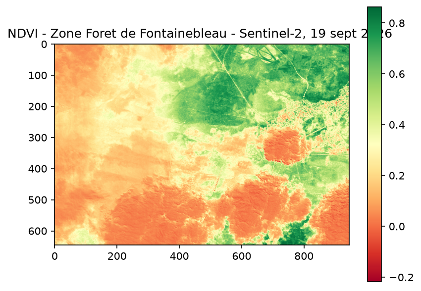

# NDVI depuis données Sentinel-2 — Forêt de Fontainebleau



Calcul d'un indice de végétation (NDVI) à partir de données satellite Copernicus (Sentinel-2), avec Python.

## Contexte

Premier contact concret avec des données d'observation de la Terre. L'objectif : calculer le **NDVI** (Normalized Difference Vegetation Index), un indicateur utilisé en télédétection pour évaluer la densité et la santé de la végétation sur une zone géographique.

## Données utilisées

- Source : [Copernicus Data Space Ecosystem](https://dataspace.copernicus.eu)
- Satellite : Sentinel-2, produit L2A (données déjà corrigées atmosphériquement)
- Zone : Forêt de Fontainebleau
- Date : 18 septembre 2026
- Deux bandes spectrales au format GeoTIFF :
  - **B04** — bande rouge (~665 nm)
  - **B08** — bande proche infrarouge / NIR (~842 nm)

## Principe du NDVI

La végétation en bonne santé absorbe fortement la lumière rouge (photosynthèse) et réfléchit fortement le proche infrarouge. En comparant ces deux bandes, on détecte et quantifie la présence de végétation sur une image satellite.

**Formule :**
```
NDVI = (NIR - Rouge) / (NIR + Rouge)
```

Résultat compris entre -1 et 1 :
- proche de **1** → végétation dense et en bonne santé
- proche de **0** ou négatif → sol nu, eau, zones bâties, roche

## Ce que fait le script

1. Ouverture des deux fichiers GeoTIFF (bandes B04 et B08) avec **Rasterio**.
2. Lecture de chaque bande sous forme de tableau **NumPy**.
3. Calcul du NDVI pixel par pixel via les opérations vectorisées NumPy.
4. Visualisation cartographique avec **Matplotlib**.

## Résultat

Le patch vert dense visible sur l'image correspond au cœur de la forêt de Fontainebleau, tandis que les zones orange/rouge correspondent aux terres agricoles, zones urbanisées et affleurements rocheux caractéristiques du massif.

## Stack

Python · Rasterio · NumPy · Matplotlib

## Prochaine étape

Suivi temporel (comparaison de deux dates sur la même zone) et classification d'occupation des sols avec scikit-learn.
